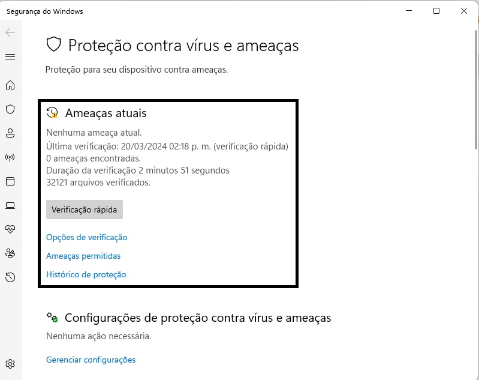

# MICROSOFT WINDOWS DEFENDER AND FIREWALL FOR BEGGINERS
<h2>DESCRIPTION</h2>
<a>Welcome to Microsoft Windows Defender and Firewall for Beginners. During your first lab, you'll review Windows Security Virus and threat protection, update threat definitions, and run Windows Defender Antivirus quick scan. When you finish your second lab, you'll be able to configure Firewall Rules using Microsoft Windows Defender Firewall with and without Advanced Security.</a>

<h2>OBJETIVES</h2>
<body>
<ul>
<li>Locate Microsoft Windows Security Virus and Threat Protection</li>
<li>Review Microsoft Windows Security Virus and Threat Protection and Update Threat Definitions</li>
<li>Run Microsoft Windows Defender Antivirus Quick Scan and Review Threat History</li>
<li>Configure Firewall Rules using Microsoft Windows Defender Firewall with and without Advanced Security</li>
</ul>
</body>

<h2>EXERCISE 1</h2>
<body>
<ol>
<li>Click the Windows Start button and select Settings.</li>
  
<li>On the Windows Settings page, select Update & Security.</li>
  
<li>Under Update & Security, select Windows Security.</li>
  
<li>Select Virus and threat protection.</li>
  
<li>On this screen, you’ll see the following features: 
  <body>
<ul>
<li><b>Current threats:</b> Here, you can see any threats that have been detected on your device. You can see when the last scan occurred, how long the scan took, and how many files were scanned. Here you can also click the button to start a quick scan or access scan options to run a full scan or a custom scan.</li>
  
<li><b>Virus & threat protection settings:</b> Here, you can access options for managing your virus and threat protection settings. You can customize your protection level, opt to send sample files to Microsoft, exclude files or folders from scans, or temporarily stop your protection.</li>
<li><b>Virus & threat protection updates:</b> Here, you can view the last time your virus definitions were updated. You can also opt to manually check for updates</li>
<li><b>Ransomware protection:</b> Here, you can choose to enable controlled folder access. This protects memory, files, and folders from unauthorized changes.</li>
  
</ul>
</body>
.</li>
</ol>
</body>

<h2>EXERCISE 2</h2>
Windows Security uses security intelligence, also known as definitions, to identify known threats. These definitions include information about known threats. These definitions are updated automatically, but if you suspect a problem with your system, you should ensure that threat definitions are up-to-date before you run a scan.
<body>
<ol>
  <li>Under Virus & threat protection updates, select Check for updates.</li>
   
  <li>You can view details for the most recent update to your threat definitions. Select Check for updates. This process could take a few minutes. When the update has completed, the Check for updates button will return, and you should notice that the last update time and date have changed. Select the back button to return to the Virus & threat protection screen.</li>
 
</ol>
</body>

<h2>EXERCISE 3</h2>
<body>
  <ol>
    <li>Now we can run an antivirus scan. Click the Quick scan button on the Virus & threat protection screen. The scan will take several minutes to run. When complete, the Quick scan button will reappear. Click Threat history to view any recent findings.</li>
     
    <li>This page shows you the results of the last scan. You see the files identified as a threat and quarantined, so they cannot damage your device. You then see files identified as potential threats but allowed to continue running.</li>
     
  </ol>
</body>
